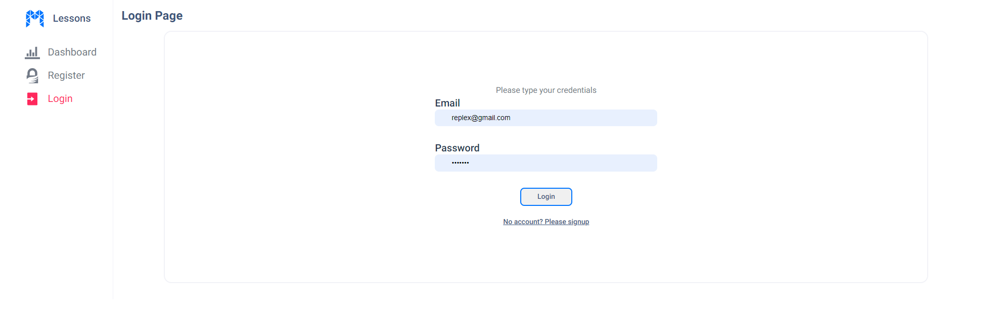
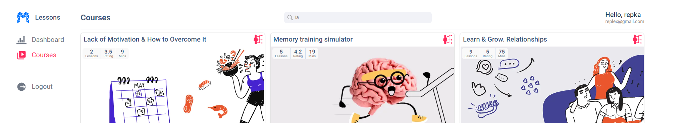
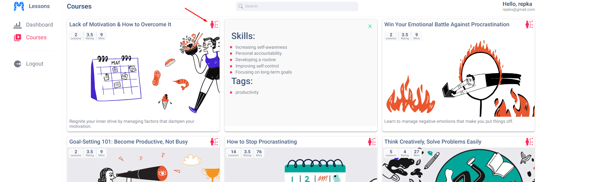
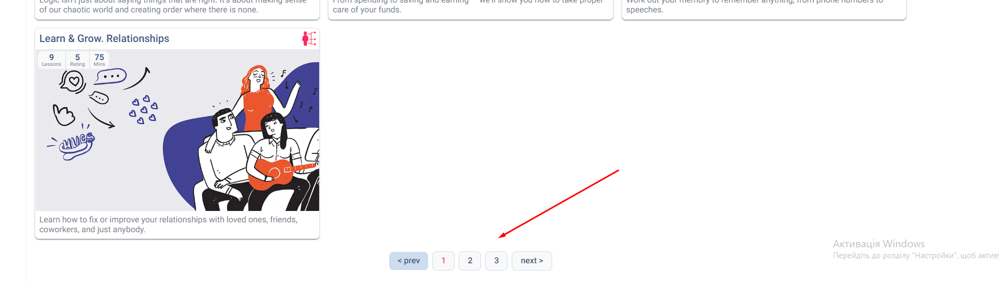
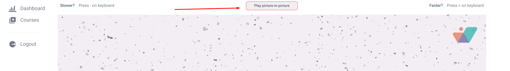
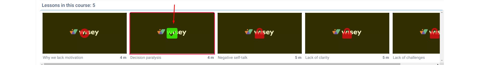

# Study app

Цей проект було створено за допомогою React. Такоє пристуній адаптив для
мобільних пристроїв.

## 0. Common

Загалом застосунок містить 6 сторінок.

1. Dashboard, NotFound - public routes.
2. Register, Login - restricted routes.
3. Home, Course - private routes.

## 1. Register and Login pages

Для того, щоб зареєструватися, або увійти в додаток скористайтеся відповідними
сторінками реєстрації або логіну

Реєстрація виконана за допомогою firebase. При реєстрації верифікація пошти і
валідація полів форми не потрібна (не налаштовував, щоб Ви не витрачали свій
час). Поля placeholder у формі сторінки логіну відповідають зареєстрованому
профілю користувача.

Після успішної реєстрації Вас буде перенаправлено на сторінку Home із всіма
курсами. Для отримання та зберігання даних про всі курси використано redux
toolkit та createAsyncThunk (просто було таке бажання).

## 2. Home page

На цій сторінці присутній пошук курсу за його заголовком. Виконана нормалізація
заголовків і поля фільтрації, щоб пошук був нечутливий до регістру.

При відображенні однієї картки при ховері відео відтворюється без звуку.
Відображено заголовок та опис курсу, а також інформацію про рейтинг, тривалість
і кількість уроків. Додаткову інформацію про скіли можна отримати при кліку на
кнопку у правому верхньму куті картки.

Проскроливши сторінку до кінця можна побачити пагінацію. Відображає поточну
кількість сторінок (кількість карток на сторінці - 10). Пагінація вимикається,
якщо після фільтрації загальна кількість курсів менше ніж 10.

## 3. Course page

На сторінці одного курсу відображається загальна інформація про курс: загаловок,
рейтинг курсу та дата додавання.

Після цього бачимо головний плеєр сторінки (тег video). Під час відтворення
відео, коли плеєр перебуває у фокусі, можна збільшувати та зменшувати швидкість
відтворення відео за допомогою кнопок "+" та "-" відповідно.

Додатково можна вмикати PiP за допомогою кнопки.

Внизу сторінки відображено загальну кількість уроків для даного курсу. Показано
кількість уроків в курсу, короткий опис уроку і його тривалість. На заблокованих
уроках присутня іконка замка і їх не можна відтворити. Поточний урок також
показується активним за допомогою іконки.

Для кожного курсу у localStorage зберігається активний урок, який переглядає
користувач, і час на якому він зупинився.

## 4. Logout

При натисканні кнопки logout перенаправляє на сторінку логіну, а сама кнопка не
відображається.
